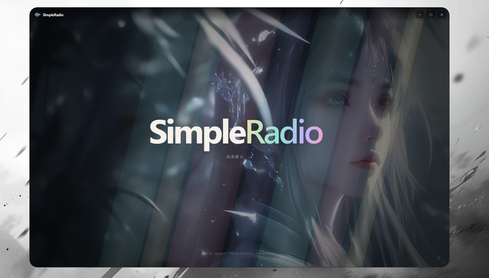
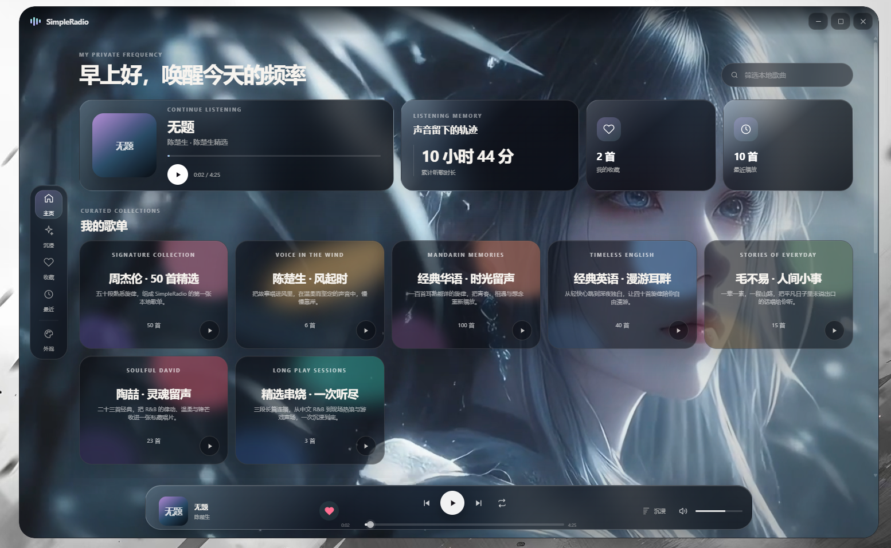
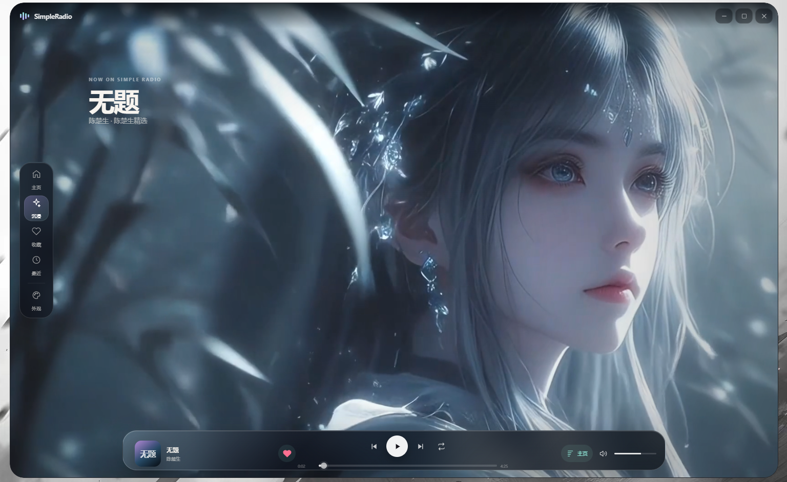
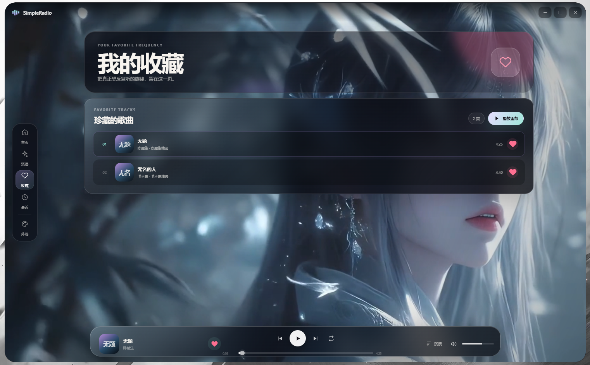
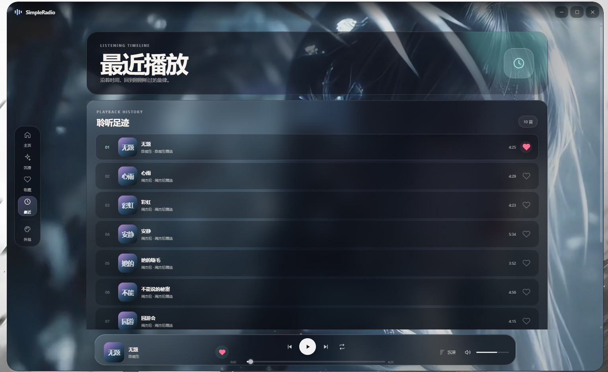
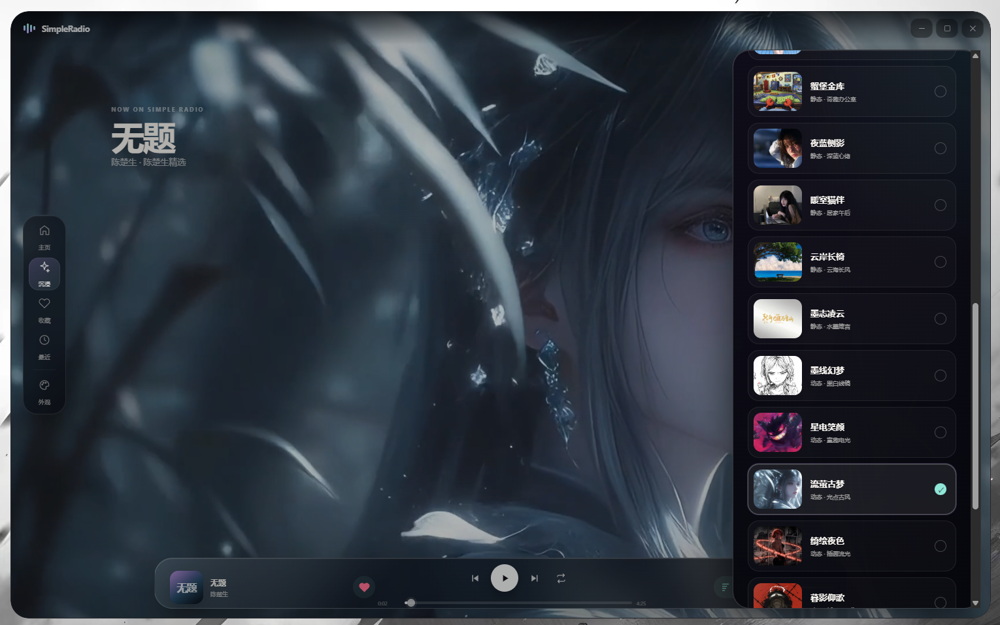

# SimpleRadio

把熟悉的旋律，放进属于自己的小小电台。

SimpleRadio 是一款面向 **Windows 10/11 x64** 的离线沉浸式音乐播放器：精选歌单、动态壁纸、收藏与聆听记录融为一体。无需登录、无需音乐平台会员；成品包含运行环境，完整解压后即可使用。

[下载与使用](#下载与使用) · [界面预览](#界面预览) · [开发与二次开发](#开发与二次开发) · [本地数据与隐私](#本地数据与隐私) · [常见问题](#常见问题) · [许可](#许可)

> 当前版本：**1.4.2**。本仓库公开完整程序源码、构建脚本和测试；大体积音乐与高清壁纸通过 Release 分发，不放进 Git 历史。**Release 下载附件正在准备，附件齐全后才能按下面教程下载成品。**

## 特性

### 好好听歌，无需配置开发环境

- **离线使用**：成品内置 7 张精选歌单、237 首音频，下载并合并解压后，不联网也能播放。
- **免安装**：不需要安装 Node.js、npm、Electron 或 Wallpaper Engine；Windows 成品已带齐运行环境。
- **固定歌单体验**：每张歌单有自己的名字、介绍、渐变配色和准确曲目数，可打开详情逐首选歌，也可直接播放全部。
- **清晰的播放控制**：上一首、播放/暂停、下一首、顺序播放/单曲循环、音量和静音；进度条可点击和拖动。
- **本地搜索**：按歌名、歌手或归属筛选已经内置的歌曲，不接入在线搜索。

### 让界面融入音乐

- **主页**：时段问候、当前歌曲、累计听歌时长、歌单入口，以及循环最多的十首。
- **沉浸页**：仅保留歌曲信息、导航和底部播放控制，让背景皮肤成为画面主角。
- **21 款皮肤**：4 套静态渐变、9 张静态图片、8 段动态壁纸，支持可见度、暗度、模糊调节。
- **轻量外观控制台**：图片与视频都使用预生成的小封面；切换皮肤不重建整张列表，减少封面闪烁和打开卡顿。
- **系统托盘**：点击右上角 × 隐藏窗口并继续听歌；通过托盘重新显示或彻底退出。

### 记住你的聆听习惯

- 心形按钮一键收藏；收藏页支持“播放全部”。
- 最近播放实时展示最新 **10 首不同歌曲**，重复播放会更新排序。
- 累计实际聆听时长、有效播放次数与常听排行；拖动进度不会把跳过的时间算作听歌。
- 收藏、队列、进度、音量和皮肤设置保存在当前 Windows 用户的本地目录，不上传云端。

### 清晰的产品边界

本版不提供添加歌曲、导入歌单、歌词、音乐律动可视化、在线音乐检索、账号或云同步。普通用户使用内置内容；开发者可修改源代码、曲库定义及构建脚本来制作自己的版本。

## 界面预览

以下六张图片由项目维护者提供，标题沿用原文件名（不含扩展名）。截图中的收藏和听歌时长仅为演示，**不会随成品分发给新用户**。

### 启动界面



### SimpleR主页



### SimpleR沉浸页



### SimpleR收藏页



### SimpleR最近播放



### SR外观控制台



## 内置歌单

| 歌单 | 曲目数 | 主题 |
| --- | ---: | --- |
| 周杰伦 · 50 首精选 | 50 | 玫紫，熟悉的青春旋律 |
| 陈楚生 · 风起时 | 6 | 暖金与青灰，温柔而坚定 |
| 经典华语 · 时光留声 | 100 | 珊瑚与紫红，华语记忆 |
| 经典英语 · 漫游耳畔 | 40 | 冰蓝，自由漫游 |
| 毛不易 · 人间小事 | 15 | 鼠尾草绿与米金，日常叙事 |
| 陶喆 · 灵魂留声 | 23 | 绯红与柔紫，R&B 留声 |
| 精选串烧 · 一次听尽 | 3 | 青绿与深蓝，长篇音乐合集 |
| **合计** | **237** | 同名歌曲可能属于不同音频版本 |

## 下载与使用

### 第一步：进入 Releases，而不是 Download ZIP

打开 [SimpleRadio Releases](https://github.com/Alex213321/SimpleRadio/releases)，选择 **v1.4.2**，在 **Assets** 中下载以下两个文件：

| 文件 | 是否必需 | 包含内容 |
| --- | --- | --- |
| `SimpleRadio-1.4.2-Program-x64.zip` | 必需 | EXE、运行环境、播放器代码、全部皮肤 |
| `SimpleRadio-1.4.2-Music.zip` | 必需 | 237 首音乐及曲库清单 |
| `使用说明-1.4.2.txt` | 建议 | 离线阅读的操作教程 |
| `SHA256SUMS.txt` | 建议 | 两个 ZIP 的完整性校验值 |

**不要只下载其中一个包，也不要把不同版本的包混在一起。** `Source code (zip)` / `Source code (tar.gz)` 以及仓库 `Code → Download ZIP` 下载的是源码，不是可直接运行的 Windows 成品。

为什么拆包？完整 1.4.2 ZIP 约 2.113 GiB，而 [GitHub Release 单个附件必须小于 2 GiB](https://docs.github.com/en/repositories/releasing-projects-on-github/about-releases)。两个 ZIP 是可以分别解压的普通压缩包，不是必须安装 7-Zip 才能合并的 `.001/.002` 分卷。

### 第二步：把两个 ZIP 解压到同一个位置

1. 在本地新建一个文件夹，例如 `D:\Apps`。建议为下载、解压和缓存预留至少 **6 GB** 可用空间。
2. 右键 `SimpleRadio-1.4.2-Program-x64.zip` →“全部解压”。
3. 在“目标文件夹”中明确选择 `D:\Apps`。解压后得到 `D:\Apps\SimpleRadio-1.4.2`。
4. 再右键 `SimpleRadio-1.4.2-Music.zip` →“全部解压”。
5. **把目标文件夹也改为 `D:\Apps`**，让同名 `SimpleRadio-1.4.2` 目录合并。不要沿用 Windows 自动建议的、以第二个 ZIP 名字命名的新文件夹。
6. 如果 Windows 询问合并同名文件夹，选择合并。全新解压的两个包没有需要互相覆盖的同名文件。

两个包内部都有一层 `SimpleRadio-1.4.2`。最终结构必须像下面这样：

```text
D:\Apps\SimpleRadio-1.4.2\
├─ SimpleRadio.exe
├─ locales\
├─ resources\
│  ├─ app.asar
│  └─ music-library\
│     ├─ manifest.json
│     ├─ jay\
│     ├─ chen\
│     ├─ mandarin\
│     ├─ english\
│     ├─ mao\
│     ├─ tao\
│     └─ medley\
└─ 其他 DLL、PAK 和运行文件……
```

如果出现两份分离的 `SimpleRadio-1.4.2` 文件夹，可把音乐包中的 `resources\music-library` 整个文件夹复制到 **EXE 所在目录的 `resources` 内**。不要将其放在 EXE 同级，也不要多嵌套一层 `resources`。

### 第三步：启动并听歌

1. 双击 `SimpleRadio.exe`，点击启动画面中的 SimpleRadio 进入主页。
2. 点击歌单卡片查看曲目，再点击一首歌曲播放；或者点击卡片播放按钮/详情页“播放全部”。
3. 点击心形图标收藏歌曲，在左侧“收藏”页集中播放。
4. 点击左侧“沉浸”或底部“沉浸”按钮进入沉浸页；底部按钮会变为“主页”，点击可返回。
5. 拖动底部进度条调整播放位置，点击双箭头按钮切换模式：中间有 `1` 表示单曲循环，没有 `1` 表示顺序播放。
6. 点击左侧“外观”选择皮肤，向下滚动可调节壁纸参数。

**不要在压缩包预览窗口中直接运行 EXE，也不要只把 EXE 单独复制出去。** 完整运行单位是整个程序文件夹。可以为 EXE 创建桌面快捷方式，其他文件留在原目录。

### 托盘与快捷键

| 操作 | 结果 |
| --- | --- |
| 窗口右上角 × | 隐藏到托盘，音乐继续播放 |
| 单击/双击 SR 托盘图标 | 重新显示播放器 |
| 托盘右键 → 退出 | 完全退出播放器 |
| `Space` | 播放/暂停（输入框中除外） |
| `←` / `→` | 后退/前进 5 秒 |
| `Ctrl + K` | 聚焦歌曲搜索 |
| `Esc` | 关闭面板、弹窗，或返回主页 |

首次运行没有收藏、最近播放和累计时长是正常的；它们从你开始听歌后独立记录。

## 本地数据与隐私

程序通过 Electron 的 `app.getPath('userData')` 保存数据。正式成品在 Windows 中通常位于：

```text
%APPDATA%\SimpleRadio\library.json
```

也就是 `C:\Users\你的用户名\AppData\Roaming\SimpleRadio\library.json`。可以把 `%APPDATA%\SimpleRadio` 粘贴到文件资源管理器地址栏打开。开发环境的应用数据目录名称可能与成品不同。

`library.json` 保存收藏、曲目最近播放时间、有效播放次数、累计聆听秒数、当前曲目与队列、进度、音量和壁纸设置。最近播放页面从这些时间戳中排序并取前 10 首，并非不断增长的逐次事件日志。

- **不同电脑、不同 Windows 用户各自独立**；全新环境从零记录，不包含维护者的个人数据。
- 同一 Windows 用户重新解压或升级程序，一般继续使用已有数据，不会因程序目录改变而清零。
- 数据没有账号、云同步、远程服务器或主动上传功能；本地 JSON 不是加密保险箱，同一电脑上有文件读取权限的人可能读取它。
- 程序还会在用户目录创建 `built-in-wallpapers` 壁纸副本及 Electron 缓存，这是正常运行数据，不是个人听歌记录。
- 删除解压目录不等于清除 AppData。备份/迁移记录时，先通过托盘彻底退出，再备份 `library.json`；恢复时先备份目标电脑已有文件，避免覆盖丢失。
- 部分曲库迁移会生成 `library.json.before-catalog-时间戳.bak`；解析损坏文件时也会尽力保留副本。

这里的 Portable 表示**免安装、目录可移动**，不表示“个人记录跟着 U 盘移动且电脑上不留数据”。音乐和皮肤跟着程序目录走，个人记录留在 Windows 用户目录。

## 开发与二次开发

普通用户不需要本节。开发者需要 Git、Node.js 22 或更新的兼容版本，以及 npm。当前发布和验证目标是 Windows x64；macOS/Linux 没有提供成品或兼容性承诺。

### 1. 克隆与安装依赖

```powershell
git clone https://github.com/Alex213321/SimpleRadio.git
cd SimpleRadio
npm ci
npm run test:unit
```

源码提供 `package-lock.json`；`npm ci` 按锁文件安装依赖，包括开发用 Electron。第一次安装需要网络。不存在安装依赖时自动扫描维护者私人音乐目录的 `prepare` 生命周期脚本。

如果较新 npm 的安装脚本安全机制提示 Electron 的 `postinstall` 尚未批准，先检查官方 `electron` 包后执行 `node node_modules/electron/install.js` 完成其运行环境下载；无需关闭全局安全机制，也无需为不使用的安装器开启所有脚本。

### 2. 恢复音乐和壁纸资源

由于资源体积较大，源码快照不内嵌完整音频和高清壁纸。先按上面的使用教程下载两个 **1.4.2** 成品包并合并解压，再在源码目录执行：

```powershell
npm run resources:import -- "D:\Apps\SimpleRadio-1.4.2"
npm run resources:verify
```

导入脚本从成品的 `resources/music-library` 读取音乐，从 `resources/app.asar` 读取壁纸；复制到源码的 `bundled-library` 与 `assets/wallpapers`。脚本按仓库中固定清单校验所有文件 SHA256，不导入成品使用者的收藏、设置或播放记录。

重复导入相同资源会跳过；发现本地已修改的资源则停止，避免意外覆盖。明确需要恢复原版资源时，先自行备份，再加 `--force`。

### 3. 运行、测试和构建

```powershell
npm start
npm run dev
npm test
npm run dist:win
```

- `npm start`：启动开发版。
- `npm run dev`：启动并打开开发者工具；它不是网页开发服务器。
- `npm run test:unit`：不需要大型素材的纯逻辑/结构测试，GitHub Actions 执行这一组。
- `npm test`：包括完整曲库和壁纸资源校验；先完成资源导入。
- `npm run pack`：生成 `release/win-unpacked` 可运行目录。
- `npm run dist:win`：验证资源后构建完整 Windows ZIP，资源不会从原 D 盘路径临时引用。

资源就绪后不依赖维护者的原始文件夹。Windows 成品未签名；签名、跨平台打包和后续自动更新属于开发者自行扩展范围。

### 4. 修改从哪里开始？

| 想修改什么 | 主要文件 |
| --- | --- |
| 页面布局、按钮和面板 | `src/index.html` |
| 颜色、排版、渐变与动画 | `src/styles.css` |
| 播放、队列、搜索与交互 | `src/app.js` |
| 歌单名称、简介、数量、配色和排序规则 | `electron/catalog.cjs` |
| 壁纸名称、类型、文件名和预览配置 | `electron/wallpapers.cjs` |
| 数据存储与迁移 | `electron/store.cjs`、`electron/library-utils.cjs` |
| 窗口、托盘、协议与系统接口 | `electron/main.cjs`、`electron/preload.cjs` |
| 曲库元数据整理、资源复制与打包 | `scripts/`、`package.json` |

如果替换/增加曲目，不要只往文件夹里塞 MP3。当前曲库有稳定 ID、数量与完整性校验；需要同步歌单定义、生成清单、更新资源哈希和测试。原始素材维护流程、修改皮肤与发布方法见 [开发说明](docs/DEVELOPMENT.md)。

## 目录结构

```text
SimpleRadio/
├─ electron/                 主进程、预加载桥接、曲库、存储、媒体协议
├─ src/                      HTML / CSS / JavaScript 界面与播放器交互
├─ assets/
│  ├─ icon.png / icon.ico    应用与托盘图标
│  ├─ icon-source-v3.png     图标设计源图
│  ├─ resource-manifest.json 固定版本资源大小与 SHA256 清单
│  └─ wallpapers/           导入后生成；大素材不提交 Git
├─ bundled-library/          导入后生成；237 首音频与曲库清单
├─ scripts/                  素材整理、导入、验证、封面生成、成品拆包
├─ tests/                    逻辑、结构、迁移和资源测试
├─ docs/                     开发、需求、架构、验收、发布说明与六张预览图
├─ .github/workflows/        无大型素材依赖的源码检查
├─ package.json              依赖、命令与 Electron Builder 配置
├─ package-lock.json         锁定依赖版本
├─ LICENSE                   MIT 代码许可
├─ ASSET_LICENSES.md         第三方素材的独立许可说明
├─ THIRD_PARTY_NOTICES.md    第三方软件与运行库提示
└─ release/                  本地构建输出；不提交 Git
```

## 项目开发原理

SimpleRadio 不启动服务端，也不是把在线网页套进窗口。它使用 [Electron 的主进程/渲染进程模型](https://www.electronjs.org/docs/latest/tutorial/process-model)，将本地网页技术组成桌面应用：

1. **主进程 `main.cjs`** 管理窗口、托盘、文件访问与保存，加载已登记的固定曲库。
2. **预加载桥接 `preload.cjs`** 只向界面提供有限的白名单方法，例如收藏、保存设置、窗口控制。界面不能直接任意读取电脑文件。
3. **渲染层 `src/`** 用原生 HTML、CSS 和 JavaScript 绘制页面，以 `HTMLAudioElement` 播放音频，不依赖 React/Vue 或在线平台。
4. **本地媒体协议** 将歌曲 ID 映射到资源文件；支持 Range 分段读取，因此长音频也可拖动进度，不必先把整首装进内存。
5. **壁纸层** 用图片/视频铺底，视频双层切换；窗口隐藏时暂停壁纸以减少后台消耗。封面在构建期生成，面板不同时启动八个预览视频。
6. **存储层** 用临时 JSON 写入后重命名，降低半写入风险；稳定 ID 用于升级时匹配旧收藏与统计。

启用 `contextIsolation`、沙箱并关闭渲染层 Node 集成；界面使用本地内容安全策略，禁止联网请求。这些是防护措施，不等于对所有潜在安全问题作绝对保证。更详细的实现见 [技术设计](docs/TECHNICAL_DESIGN.md)。

## 常见问题

| 问题 | 检查方法 |
| --- | --- |
| 下载后没有 EXE | 是否下载了源码 ZIP？普通用户应下载 Release 中的 Program 和 Music |
| 有 EXE，但提示曲库缺失 | 是否漏下 Music 包，或解压到了另一个文件夹？核对 `resources/music-library/manifest.json` |
| 程序包与音乐包都解压了仍失败 | 是否多嵌套了一层文件夹？两个包是否同版本？是否解压中断？ |
| Windows 提示未知发布者 | 本项目尚未代码签名。先确认来自本仓库官方 Release 并核对 SHA256；不要关闭杀毒软件或忽略明确的恶意软件警报 |
| 点击 × 后仍有声音 | 这是托盘设计。请在右下角托盘中右键 SR → 退出 |
| 找不到托盘图标 | 展开 Windows 右下角隐藏图标区域 |
| 没声音 | 检查应用静音、音量、Windows 音量混合器及当前输出设备 |
| 动态壁纸较卡 | 选择静态皮肤，降低背景模糊，检查显卡驱动和后台负载；旧硬件不保证相同帧率 |
| 复制到新电脑后记录为空 | 正常，记录在每台电脑的 AppData，不在程序文件夹 |
| 在同一电脑重新解压记录没归零 | 正常，同一 Windows 用户继续使用原来的本地数据 |
| 源码 `npm test` 报资源缺失 | 先运行 `resources:import`；只验证无素材代码可用 `test:unit` |
| `npm ci` 下载 Electron 失败 | 检查网络、代理及 npm/Electron 下载访问；不要下载来历不明的替代 EXE |
| 构建完整 ZIP 超过 GitHub 限制 | 使用 `scripts/split-release.ps1`，不要把大型二进制提交到 Git |

遇到问题可在 [Issues](https://github.com/Alex213321/SimpleRadio/issues) 提交 Windows 版本、播放器版本、复现步骤和截图。不要公开上传完整 `library.json`、个人路径、账户信息或带敏感数据的日志。

## 版本与贡献

1.4.2 重点优化外观控制台的打开和封面渲染。原成品通过 34 项测试和 237/237 音频解码检查；开源工程额外提供资源恢复与发布脚本测试。性能结果是测试机器上的观测，不是所有电脑的保证。见 [版本记录](CHANGELOG.md) 和 [验收记录](docs/ACCEPTANCE.md)。

欢迎 Fork 后改进界面、测试、无障碍、性能和文档。提交前运行相关测试；不要提交 `node_modules`、私人播放数据、未获授权媒体或新的大体积发布包。见 [贡献说明](CONTRIBUTING.md)。

## 许可

程序源代码和项目自有文档采用 [MIT License](LICENSE)，允许在遵守许可要求的前提下修改、使用和再分发。

**歌曲、第三方图片、动态壁纸、字体和其他第三方内容不自动适用 MIT。** 维护者已确认具备本版本素材的公开再分发授权；这不等于向所有下游授予素材的任意商用、改编或再次分发权。具体边界见 [素材许可说明](ASSET_LICENSES.md)。软件依赖与 Electron 自带组件另受其各自许可约束，见 [第三方软件说明](THIRD_PARTY_NOTICES.md)。

本软件按“现状”提供，无担保。请尊重创作者及权利人的授权范围。
